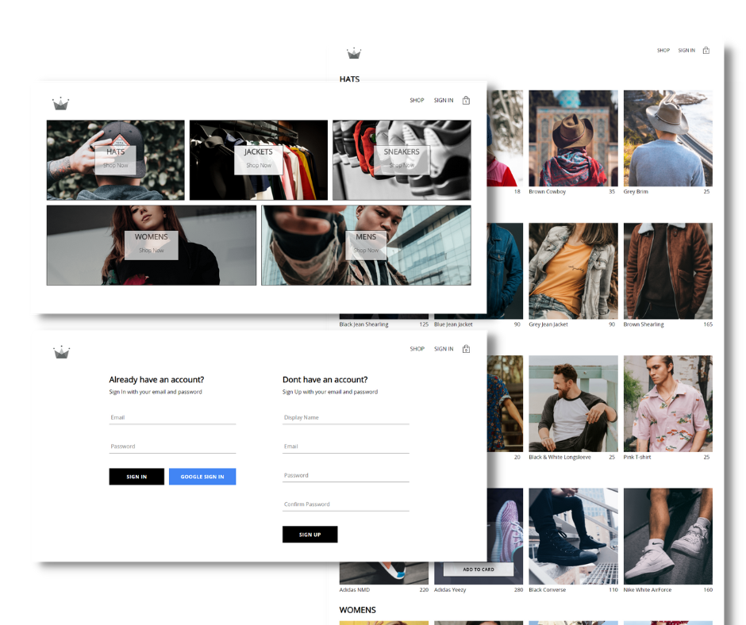

# Crown Clothing

Crown Clothing is an a clothing e-commerce web app that allows businesses to sell clothing products online. This web include features such as a product catalog, shopping cart, payment gateway integration, and secure checkout process.

### Links

- Live Site URL: [https://crown-cloth-pperdana.netlify.app](https://crown-cloth-pperdana.netlify.app)

## Table of contents
  - [Overview](#overview)
    - [Features](#features)
    - [Screenshot](#screenshot)
  - [Tech stack](#tech-stack)
  - [Author](#author)

## Overview

### Features

- Display products online
- Provide product descriptions, pricing, and images
- Offer payment options
- Secure online transactions using SSL encryption and other security measures
- Provide customers with shopping carts to add and manage products they want to purchase
- Allow customers to create accounts to store their personal information and track their orders

### Screenshot

## Tech stack
- React
- Firebase
- React Router
- Redux
- Redux Saga
- Stripe
- Context API
- Styled Components
- React Hook
- Semantic HTML5 markup
- CSS Custom Properties
- Mobile First Workflow
- CSS Grid
- Flexbox

## Author

- Website - [pperdana.netlify.app](https://pperdana.netlify.app)
- Frontend Mentor - [@Panji200](https://www.frontendmentor.io/profile/Panji200)
- Email - panjiperdana088@gmail.com
